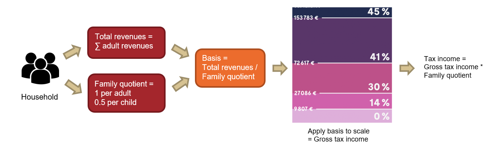

# Lab 02

## Requirements

<p align="center">
  
</p>

## To do

Implement `compute` method in [`Service`](./src/main/java/training/lab/Service.java) class which will compute the tax for a household

```jav 
BigDecimal compute(final Household household)
```
